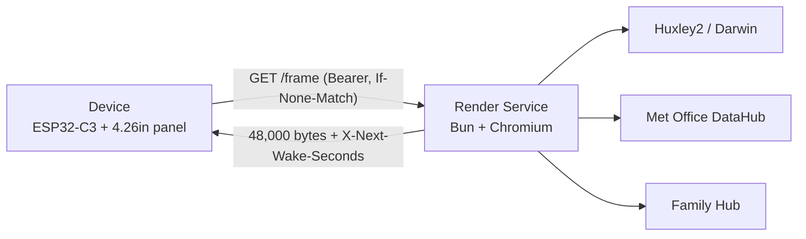
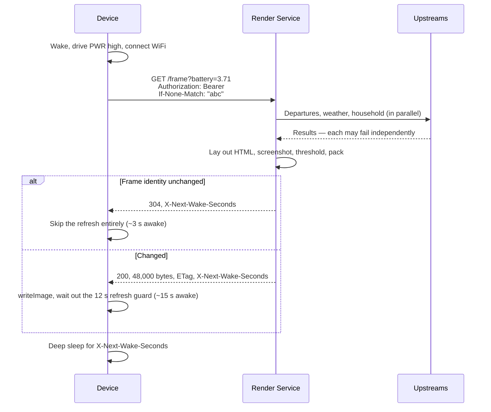

# Architecture

> System design, components, and data flow for `display`.

## Overview

Two components joined by one HTTP request. A battery-powered ESP32-C3 on the
fridge wakes on a schedule and does exactly one thing — `GET /frame` — then
writes the 48,000 bytes it gets back straight to the panel and sleeps for as
long as the response told it to. A Bun container in the homelab does everything
else: fetch from three upstreams, lay the page out in HTML/CSS, screenshot it
with headless Chromium, threshold to pure black and white, pack to one bit per
pixel.

The device owns no layout, no data and no schedule. That is the whole design —
see [ADR-0001](adr/0001-server-renders-the-frame.md) and
[ADR-0002](adr/0002-server-owns-the-wake-schedule.md). Vocabulary is in
[CONTEXT.md](CONTEXT.md).

## Diagram

## Components

| Component | Responsibility | Location |
| --- | --- | --- |
| Firmware | Wake, power the panel, connect to WiFi, fetch a Frame, write it, deep sleep | `apps/firmware/src/main.cpp` |
| Frame Client | The one HTTP call, plus ETag bookkeeping across deep sleep | `apps/firmware/src/FrameClient.cpp` |
| Composition root | Read config, build sources, start `Bun.serve` | `apps/server/src/main.ts` |
| Request handler | Auth, routing, ETag/304, `X-Next-Wake-Seconds` | `apps/server/src/server.ts` |
| Frame Composer | Gather all three sources, build the view, rasterise, hash | `apps/server/src/frame.ts` |
| Layout | The 800×480 page as HTML/CSS | `apps/server/src/render/layout.ts` |
| Rasteriser | Chromium screenshot → threshold → 1-bit pack | `apps/server/src/render/rasteriser.ts`, `packMonochrome.ts` |
| Sources | Huxley2, Met Office and Family Hub adapters, each behind a small interface | `apps/server/src/sources/` |
| Domain | Catchable departures, dayparts, wake schedule, weather and household shapes | `apps/server/src/domain/` |

## Request Flow

A source that fails costs its own zone and nothing else — a dead Met Office
loses you the weather, not the train times. Every source returns a `Result`
rather than throwing (`apps/server/src/domain/result.ts`).

If the Frame cannot be composed at all the service answers `503` **with** the
wake header, so the device leaves the last image up rather than showing
something wrong, and retries after a normal sleep.

## Dayparts and the Wake Schedule

What the Frame is about changes with the hour. Inside the commute window a
train you could still catch is the most useful thing on the fridge; outside it
the trains have gone and that zone is worth more to the weather. See
`apps/server/src/domain/daypart.ts`.

| Daypart | When | Left column shows |
| --- | --- | --- |
| `commute` | `COMMUTE_STARTS_AT`–`COMMUTE_ENDS_AT`, default 06:00–09:00 | Departures |
| `day` | Everything else | Weather, now and tomorrow |

Every other zone is the same in both, the calendar column included: today's
entries above, the next seven days below.

The window is half open — a Frame rendered at exactly the end minute is already
`day`, or 09:00 would show a board whose first train has invariably gone.

The service picks the sleep interval too; the device just obeys the header.
Intervals live in `WakeIntervals` in `apps/server/src/config.ts`.

| Condition | Interval |
| --- | --- |
| Inside the commute window | 10 min |
| Any other time | 30 min |
| Battery below 3.5 V | 120 min |

The dense wake window *is* the commute window rather than a second opinion
about it, so the two cannot drift apart and leave a stale board on the fridge.

Nothing sleeps longer than 30 minutes on a normal day, because the ESP32-C3's
RC oscillator drifts by percent over long sleeps. Frequent wakes are affordable
only because most of them are 304s.

## Key Decisions

- **[ADR-0001](adr/0001-server-renders-the-frame.md)** — the server composes the
  Frame; the device only shows it. Rejected: rendering on-device. Layout changes
  most, and it is on a fridge.
- **[ADR-0002](adr/0002-server-owns-the-wake-schedule.md)** — the server owns
  cadence via `X-Next-Wake-Seconds`. Rejected: a fixed interval in firmware.
- **[ADR-0003](adr/0003-no-ota-firmware-updates.md)** — no OTA. USB reflash
  only, since the firmware is designed not to change.
- **ETag is not a hash of the Frame bytes** — it hashes a stripped copy of the
  HTML that excludes the clock, or every wake would be a redraw. See
  `renderFrameIdentityHtml` in `apps/server/src/render/layout.ts`.
- **Pure black and white, no greys** — the rasteriser thresholds at mid grey, so
  a page drawn only in `#000` and `#fff` looks the same in your browser as on
  the panel.

## Data Model

The Frame is the only thing that crosses the boundary, and it is not structured
data — it is the panel's native framebuffer.

| Property | Value |
| --- | --- |
| Geometry | 800 × 480, 1 bit per pixel |
| Size | 48,000 bytes, fixed |
| Bit order | Most significant bit leftmost |
| Polarity | A set bit is white, matching `clearScreen`'s `0xFF` default. Do not invert |

Two constraints are asserted independently on both sides and enforced by
nothing:

- The geometry above, declared in `apps/firmware/include/Frame.h` and
  `apps/server/src/render/packMonochrome.ts`.
- The Offline Marker corner. The firmware stamps a 16×16 tile blind at
  (776, 456) when a fetch fails; the layout keeps that corner clear with
  `padding-right` on the last band section. Move one and you must move the
  other — see `apps/firmware/include/OfflineMarker.h` and
  `apps/server/src/render/layout.ts`.

## External Dependencies

| Service | Purpose | Failure mode |
| --- | --- | --- |
| Huxley2 / Darwin | Live departure board | Departures zone says so; the rest of the Frame renders. The public Huxley2 instance has no uptime guarantee |
| Met Office DataHub | Weather. Free tier is 360 calls/day; this uses ~90 | Weather zone says so. Unset token is treated the same as a dead upstream |
| Family Hub | Calendar, dinner, chores. Four calls: the dashboard, two Monday-anchored calendar weeks, and the user list | Household zones say so. Both `HUB_ACCESS_TOKEN` and `HUB_BASE_URL` must be set or the zones report themselves unconfigured |
| The Render Service itself | Everything | The device stamps the Offline Marker and leaves the last Frame up |
